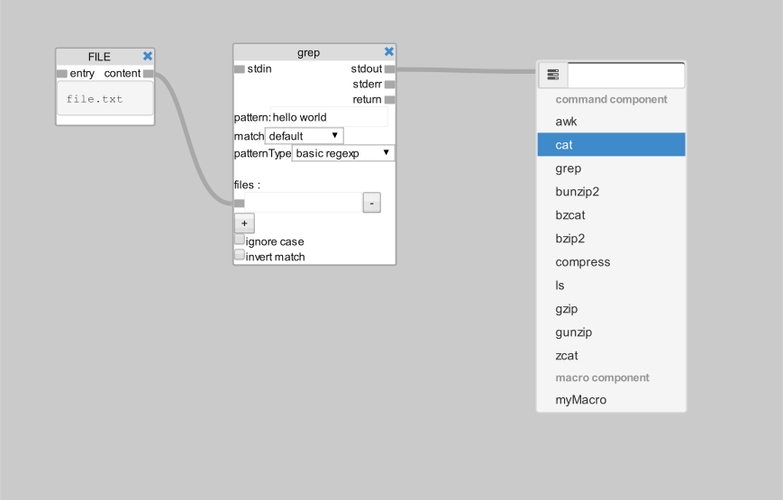
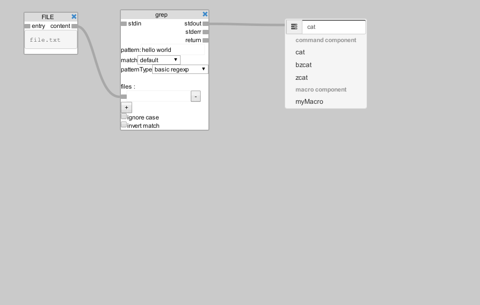
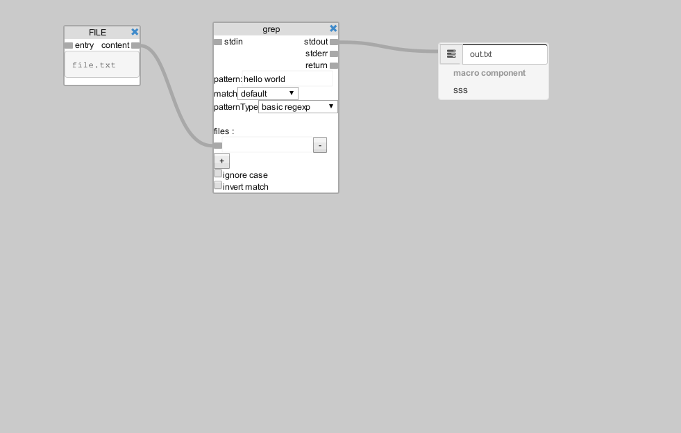

# Components

In this module exists 3 types of components

  * ** Command Component ** - represents a Unix command
  * ** File Components ** - represents a file that will be used for input and output 
  * ** Macro Components ** - represents macros in the graph, a macro is a composition of interconnected commands 

## Creating components

There are 2 ways to create components, one way is by using the top bar, and
the other by connecting a port to an empty space. When connecting to an empty
space a popup menu appears, this popup allow allows to create a componenont
efficiently

### Creating a command component by using the mouse

You can create a component using the mouse, when you click on the option, it
will generate a command component onthe specified position
 > > > >

### Creating command component by using the text field

When creating a component, you can write a command on the text field, they
should be one of the commands on the list, you can also add options on the
command application. Note that only one command is going to be created, so
pipes wont work correctly

 > > > >

### Creating file component by using the text field

To create a file component just add a file to be added

 > > > >

### Creating command component with arguments by using the text field

  
 > > > >

# Macros
